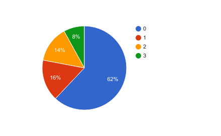

# Annotation Policy

## Document Quality

The Document Quality is scored by 0/1 value. 

* Is the document could be recommended to your junior colleague?
* Is the document is original
  * Not copy of the official tutorial or installation guide.

We (=3 annotators) scored the 0/1 quality score to 100 posts of [Qiita](http://qiita.com/).

* The concordance rate is 70% (62% is all 0, 8% is all1).
* The result detail is following.

